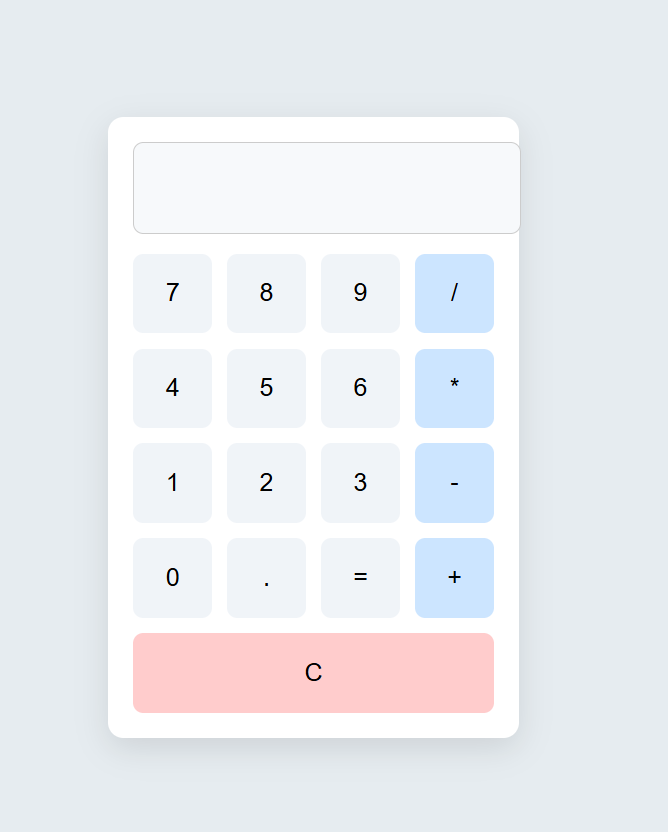

# 🔢 Web Calculator

This is a simple, clean, and responsive calculator built using **HTML**, **CSS**, and **JavaScript**. It performs basic arithmetic operations like addition, subtraction, multiplication, and division. 

## 🚀 Live Demo

Check it out live here: [View Calculator](https://n-d-yogeshwar.github.io/CALCULATOR)

## 🛠️ Technologies Used

- HTML
- CSS
- JavaScript

## 📂 Project Structure

## 🧠 Features

- Basic arithmetic operations (+, −, ×, ÷)
- Clear (C) and backspace (←) functions
- Responsive layout

## 📸 Screenshot

## 🤝 Contributing

Feel free to fork this project and submit pull requests.

## 📄 License

This project is open-source and available under the [MIT License](LICENSE).
